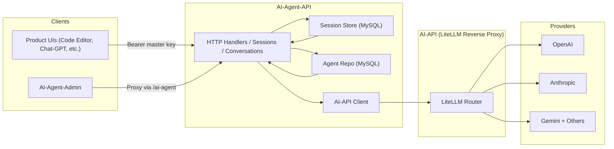

# [AI-Agent-API: Conversational Orchestrator](/ai-agent-api)

A Go service that sits in front of LiteLLM, stores every agent/session/message in MySQL, and exposes an OpenAI-style API for any product that needs structured AI conversations with tool calling.

## Overview

`mono/ai-agent-api` is the control plane for all of my AI-powered experiences. It defines agent behavior (prompt, model, tool schema, fallback order), tracks long-running conversations, persists every message/tool call, and proxies completions through LiteLLM with centralized authentication and cost controls. Products such as Code Editor, AI Agent Admin, and Chat-GPT talk to this service instead of hitting providers directly.




## Key Features

### Agent Governance
- **Structured Catalog**: Agents live in the `agent` table with key, display name, system prompt, default/fallback models, temperature, metadata, and JSON tool definitions.
- **CRUD API**: `/ai-agent-api/agents` supports pagination, creation, updates, and soft deletes with cursor-based navigation and validation.
- **Unsupported Flags**: Each response includes an `unsupported_models` array so downstream UIs can highlight fallback combos that no longer exist upstream.

### Session & Conversation Graph
- **Dual Containers**: Conversations group multiple sessions over time, while sessions represent a single run tied to one agent and override settings such as allowed tools or temperature.
- **Message Audit Trail**: Every message stores role, model, tool call payload, metadata, and timestamps, making it easy to replay or export transcripts.
- **Tool Awareness**: The store persists tool_call ids and function arguments so tool responses can be reconciled even after retries.

### LiteLLM Proxy & Streaming
- **Unified Client**: The handler translates stored history into OpenAI `chat.completions` payloads and forwards them to LiteLLM, which in turn fans out to OpenAI, Anthropic, Gemini, etc.
- **Streaming Support**: If the request advertises `text/event-stream`, the service upgrades the connection, streams LiteLLM deltas back to the caller, and simultaneously saves assistant/tool messages when the stream finishes.
- **Idempotent Writes**: An LRU cache deduplicates `POST /sessions/{id}/messages` when clients send an `Idempotency-Key`, preventing double replies on network retries.

## Technical Architecture

```
mono/ai-agent-api/
├── handlers/        # HTTP handlers for agents, sessions, conversations, models
├── internal/
│   ├── agents/      # Repository (MySQL) + domain models
│   ├── sessions/    # Conversation store, pagination, tool call structs
│   ├── litellm/     # HTTP client wrapper
│   ├── models/      # Catalog client for supported models
│   └── idempotency/ # TTL cache
└── main.go          # Router wiring + dependency injection
```

The service uses Go 1.22 with the new `http.ServeMux` pattern, so routes look like:

```go
mux.Handle("POST /ai-agent-api/sessions/{id}/messages",
  handlers.RequireBearer(masterKey, addMessageHandler))
```

Each handler executes three layers:
1. **Auth**: `handlers.RequireBearer` enforces the master key and short-circuits unauthorized calls.
2. **Store Interaction**: Reads/writes against MySQL via repositories (`agents.SQLRepository`, `sessions.Store`).
3. **LiteLLM Calls**: Builds `openai.ChatCompletionNewParams`, forwards them to LiteLLM, and persists resulting assistant/tool messages.

## Implementation Details

- **Pagination Helpers**: `internal/pagination` encodes created-at cursors so every list endpoint supports forward/backward paging without integer offsets.
- **Temperature & Settings**: Sessions can override temperature or other knobs via the `settings` JSON blob; when absent, the agent's default temperature applies.
- **Model Catalog**: A lightweight `/models` endpoint hits LiteLLM’s catalog to surface which model ids and providers are currently available.
- **Conversation Integrity**: `sessions.Store.ensureConversation` creates a conversation id on demand but validates GUIDs when clients resume an existing one, returning `ErrConversationNotFound` or `ErrInvalidConversationID` to the handler.
- **Graceful Degradation**: If LiteLLM returns an error, the handler unwraps it, maps rate limits vs upstream faults, and responds with structured JSON (`upstream_failure`, `not_found`, etc.) so clients can display actionable errors.

AI-Agent-API gives me a single, enforceable contract for every agent I run, keeping traffic observable while still letting downstream apps build their own UX.
