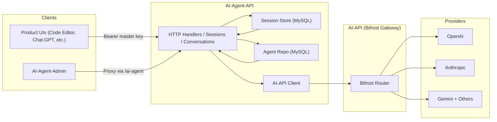

# [AI Agent: Conversational Orchestrator](/docs/oas/ai-agent-api.yml)

A two-part system that powers all of my AI experiences: a Go service that sits in front of the HomeStack AI gateway and stores every agent/session/message in MySQL, plus a Next.js operator console for managing agents and reviewing conversations.

## Overview

`mono/ai-agent-api` is the control plane for my AI-powered experiences. It defines agent behavior (prompt, model, tool schema, fallback order), tracks long-running conversations, persists every message/tool call, and proxies completions through `ai-api` with centralized authentication and cost controls. Products such as Code Editor, Chat-GPT, and AI-Agent-Admin talk to this service instead of hitting providers directly.

`mono/ai-agent-admin` is the control room that sits on top of it: a secure UI for creating/editing agents, auditing tool calls, filtering conversations, and inspecting session state without touching the database.




## AI-Agent-API

### Agent Governance
- **Structured Catalog**: Agents live in the `agent` table with key, display name, system prompt, default/fallback models, temperature, metadata, and JSON tool definitions.
- **CRUD API**: `/ai-agent-api/agents` supports pagination, creation, updates, and soft deletes with cursor-based navigation and validation.
- **Unsupported Flags**: Each response includes an `unsupported_models` array so downstream UIs can highlight fallback combos that no longer exist upstream.

### Session & Conversation Graph
- **Dual Containers**: Conversations group multiple sessions over time, while sessions represent a single run tied to one agent and override settings such as allowed tools or temperature.
- **Message Audit Trail**: Every message stores role, model, tool call payload, metadata, and timestamps, making it easy to replay or export transcripts.
- **Tool Awareness**: The store persists tool_call ids and function arguments so tool responses can be reconciled even after retries.

### Upstream Proxy & Streaming
- **Unified Client**: The handler translates stored history into OpenAI-style `chat.completions` payloads and forwards them to `ai-api`, which then routes to OpenAI, Anthropic, Gemini, etc.
- **Streaming Support**: If the request advertises `text/event-stream`, the service upgrades the connection, streams deltas back to the caller, and saves assistant/tool messages when the stream finishes.
- **Idempotent Writes**: An LRU cache deduplicates `POST /sessions/{id}/messages` when clients send an `Idempotency-Key`, preventing double replies on network retries.

### Technical Architecture

```
mono/ai-agent-api/
├── handlers/        # HTTP handlers for agents, sessions, conversations, models
├── internal/
│   ├── agents/      # Repository (MySQL) + domain models
│   ├── sessions/    # Conversation store, pagination, tool call structs
│   ├── litellm/     # HTTP client wrapper
│   ├── models/      # Catalog client for supported models
│   └── idempotency/ # TTL cache
└── main.go          # Router wiring + dependency injection
```

The service uses Go 1.22 with the new `http.ServeMux` pattern, so routes look like:

```go
mux.Handle("POST /ai-agent-api/sessions/{id}/messages",
  handlers.RequireBearer(masterKey, addMessageHandler))
```

Each handler executes three layers:

1. **Auth**: `handlers.RequireBearer` enforces the master key and short-circuits unauthorized calls.
2. **Store Interaction**: Reads/writes against MySQL via repositories (`agents.SQLRepository`, `sessions.Store`).
3. **Upstream AI Calls**: Builds `openai.ChatCompletionNewParams`, forwards them to the configured AI gateway, and persists resulting assistant/tool messages.

## AI-Agent-Admin

A Next.js 15 application that authenticates through Auth0, enforces role-based access, and proxies every request through the same host so the UI never exposes raw API keys.


### Agent Management
- **List View**: `/agents` fetches `GET /ai-agent-api/agents`, displays status badges, fallback warnings, and updated timestamps with `ClientDate`.
- **Detail & Edit**: Dynamic routes (`/agents/[key]`) surface prompt text, tool definitions, unsupported model warnings, and offer edit/delete actions.
- **Proxy Mutations**: All CRUD actions flow through `/ai-agent-admin/api/ai-agent/...`, which injects the master key and streams the upstream response straight back to the browser.

### Conversations & Sessions
- **Conversation Search**: Server-side data fetching pulls paginated conversations with filters so support can jump directly to a customer thread.
- **Session Explorer**: `/sessions` exposes status (`open/closed`), token usage, and overrides pulled from the session store, making it easy to debug a stuck pipeline.
- **Transcript Viewer**: Message timelines render user/assistant/tool entries with structured tool-call payloads for quick triage.

### Technical Architecture

```
mono/ai-agent-admin/
├── pages/
│   ├── api/ai-agent/[...path].js  # Proxy to ai-agent-api
│   ├── agents/                    # List/detail/edit pages
│   ├── conversations/             # Filters + detail views
│   ├── sessions/                  # Session explorer
│   └── dashboard.js               # KPI cards + recent activity
├── components/Layout.js           # Sidebar + shell
├── lib/                           # Auth helpers, API client, env loader
└── styles/                        # CSS modules for shared look/feel
```
