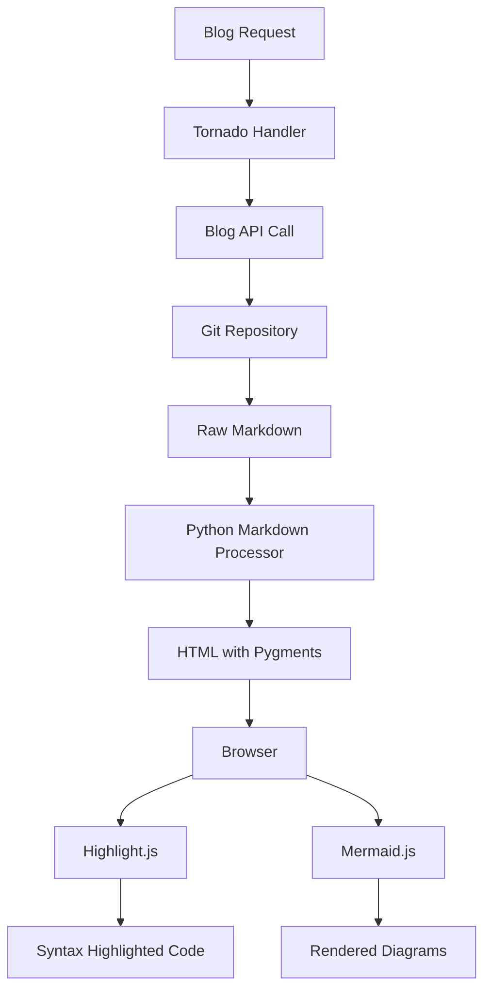

# Testing New Blog Features

This file demonstrates the enhanced markdown processing capabilities.

## Syntax Highlighting

Here's some JavaScript code:

```javascript
const openai = new OpenAI({
  apiKey: process.env.AI_API_MK,
  baseURL: `${req.headers.origin}/ai-api`,
});
```

And some Python:

```python
def process_markdown(content):
    """Process markdown content with GitHub-compatible features"""
    if not content:
        return ""

    md_processor.reset()
    html_content = md_processor.convert(tornado.escape.native_str(content))

    return html_content
```

YAML configuration:

```yaml
ai-api:
  container_name: ai-api
  image: ghcr.io/berriai/litellm:main-latest
  environment:
    - OPENAI_API_KEY=${OPENAI_API_TOKEN}
  labels:
    - traefik.enable=true
```

## Task Lists

- [x] Upgrade markdown processing
- [x] Replace Prism.js with Highlight.js
- [x] Add Mermaid support
- [ ] Test all features
- [ ] Deploy to production

## Tables

| Feature             | Status      | Priority |
| ------------------- | ----------- | -------- |
| Syntax Highlighting | ✅ Complete | High     |
| Mermaid Diagrams    | ✅ Complete | High     |
| Task Lists          | ✅ Complete | Medium   |
| Admonitions         | ✅ Complete | Low      |

## Mermaid Diagram



## Admonitions

!!! note "Information"
This is a note admonition. It provides additional context.

!!! warning "Warning"  
 This is a warning admonition. Pay attention to this information.

!!! tip "Pro Tip"
This is a tip admonition with helpful advice.

## Inline Code

You can use `inline code` with backticks, and it will be styled consistently with the new theme.

The `AI_API_MK` environment variable controls access to all models.
